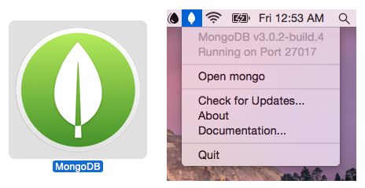

# MongoDB.app

### The easiest way to get started with MongoDB on the Mac.
_Just download, drag to the applications folder, and double-click._



### [Download](https://github.com/gcollazo/mongodbapp/releases/download/3.0.2-build-4/MongoDB.zip)
MongoDB.app with MongoDB v3.0.2 - [Release Notes](https://github.com/gcollazo/mongodbapp/releases/tag/3.0.2-build-4)

## Adding mongo binaries to your path
If you need to add the MongoDB binaries to your path you can do so by adding the following to your `~/.bash_profile`.

```bash
# Add MongoDB.app binaries to path
PATH="/Applications/MongoDB.app/Contents/Resources/Vendor/mongodb:$PATH"
```
