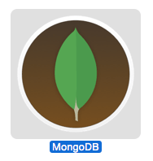

# MongoDB.app

### The easiest way to get started with MongoDB on the Mac.
_Just download, drag to the applications folder, and double-click._




## Download

[MongoDB.app v1.2.0](https://github.com/gcollazo/mongodbapp/releases/download/1.2.0/MongoDB.zip)

[Release notes](https://github.com/gcollazo/mongodbapp/releases/tag/1.2.0)

## Adding mongo binaries to your path
If you need to add the MongoDB binaries to your path you can do so by adding the following to your `~/.bash_profile`.

```bash
# Add MongoDB.app binaries to path
PATH="/Applications/MongoDB.app/Contents/Resources/Vendor/mongodb:$PATH"
```
